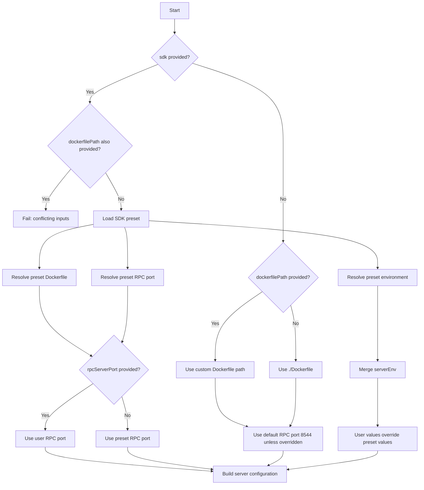

# Configure the Server

The **Hiero TCK Action** can build and start the JSON-RPC server used by the TCK, or connect to a server that is already running.

The server configuration is resolved before the TCK starts. You can either:

* Use a bundled **SDK preset**.
* Provide a custom **Dockerfile**.
* Use an **existing server** managed by your workflow.

---

## Server Configuration

The following inputs control how the JSON-RPC server is configured:

| Input                  | Default        | Description                                                                               |
| ---------------------- | -------------- | ----------------------------------------------------------------------------------------- |
| `startServer`          | `true`         | Build and start the JSON-RPC server. Set to `false` when the workflow manages the server. |
| `sdk`                  | —              | Select a bundled SDK server preset.                                                       |
| `dockerfilePath`       | `./Dockerfile` | Path to a custom Dockerfile.                                                              |
| `rpcServerPort`        | `8544`         | Port of the JSON-RPC server.                                                              |
| `serverEnv`            | —              | Environment variables passed to the server container.                                     |
| `serverStartupTimeout` | `120`          | Seconds to wait for the server to become ready.                                           |
| `buildContext`         | Workspace root | Docker build context.                                                                     |
| `dockerBuildArgs`      | —              | Additional arguments passed to `docker build`.                                            |

---

## Use an SDK Preset

The action provides bundled server configurations for supported SDKs.

Specify the SDK using the `sdk` input:

```yaml
with:
  sdk: python
```

For example:

```yaml
- name: Run Hiero TCK
  uses: hiero-hackers/hiero-tck-action@main
  with:
    sdk: python
```

### Supported SDK Presets

The current supported sdk presets are:

| SDK        | Aliases            |
| ---------- | ------------------ |
| C++        | `cpp`, `c++`, `cplusplus` |
| Go         | `go`, `golang`           |
| Java       | `java`, `jvm`              |
| JavaScript | `javascript`, `js`, `node`       |
| Python     | `python`, `py`               |
| Rust       | `rust`, `rs`               |
| Swift      | `swift`, `ios`              |

For example, these are equivalent:

```yaml
with:
  sdk: python
```

and:

```yaml
with:
  sdk: py
```

The action resolves aliases to the corresponding SDK preset.

---

## Use a Custom Dockerfile

If your SDK does not use one of the bundled presets, provide your own Dockerfile using `dockerfilePath`.

```yaml
with:
  dockerfilePath: Dockerfile
```

The path is resolved relative to the GitHub Actions workspace.

For example:

```yaml
with:
  dockerfilePath: docker/tck/Dockerfile
```

The custom Dockerfile is used only when `startServer` is `true`.

If both `sdk` and `dockerfilePath` are provided, the action fails because the two server configuration methods are mutually exclusive.

```yaml
with:
  sdk: python
  dockerfilePath: Dockerfile
```

This configuration is invalid.

!!! note
   
    When neither `sdk` nor `dockerfilePath` is provided, the action falls back to `./Dockerfile`.


---

## Configure the Docker Build Context

Use `buildContext` to specify the directory passed to `docker build`.

```yaml
with:
  buildContext: .
```

The default is the GitHub Actions workspace.

For example, if your SDK is checked out into a subdirectory:

```yaml
with:
  buildContext: ./hiero-sdk
```

This is useful when the workspace contains additional repositories or files that should not be included in the Docker build context.

!!! tip

    Keep the Docker build context as small as practical. This can reduce Docker build time and prevent unrelated files from being copied into images that use `COPY . .`.


---

## Configure the JSON-RPC Port

The `rpcServerPort` input specifies the port where the TCK connects to the JSON-RPC server.

```yaml
with:
  rpcServerPort: 8544
```

When using an SDK preset, the preset provides the default port.

An explicitly configured `rpcServerPort` takes precedence over the preset:

```yaml
with:
  sdk: python
  rpcServerPort: 9000
```

In this example, the Python preset still supplies the Dockerfile and other preset configuration, but the TCK connects to port `9000`.

When neither an SDK preset nor an explicit port is provided, the default is `8544`.

---

## Configure Server Environment Variables

Use `serverEnv` to provide environment variables to the server container.

Each variable must be specified as a separate `KEY=VALUE` line:

```yaml
with:
  serverEnv: |
    TCK_HOST=0.0.0.0
    TCK_PORT=8544
```

For example:

```yaml
- name: Run Hiero TCK
  uses: hiero-hackers/hiero-tck-action@main
  with:
    sdk: python
    serverEnv: |
      TCK_HOST=0.0.0.0
      TCK_PORT=9000
```


### Override Preset Values

If a user-provided variable has the same name as a preset variable, the user value takes precedence.

For example:

```yaml
with:
  sdk: python
  serverEnv: |
    TCK_PORT=9000
```

The resulting configuration uses:

```text
TCK_HOST=0.0.0.0
TCK_PORT=9000
```

User-defined variables that do not exist in the preset are added to the server environment.

!!! note
    
    Each `serverEnv` entry must use the `KEY=VALUE` format. Invalid entries cause the action to fail before the server is started.


---

## Configure Server Startup Timeout

After starting the server, the action waits for the JSON-RPC endpoint to become ready.

Use `serverStartupTimeout` to configure the maximum wait time:

```yaml
with:
  serverStartupTimeout: 120
```

The value is specified in seconds.

The default is:

```text
120
```

For SDKs that require a longer startup time, increase the value:

```yaml
with:
  serverStartupTimeout: 300
```

This is particularly useful when the server image has expensive initialization or requires additional time to start on a GitHub-hosted runner.


---

## Pass Docker Build Arguments

Use `dockerBuildArgs` to pass additional arguments to the Docker build.

For example:

```yaml
with:
  dockerBuildArgs: >-
    --build-arg NODE_VERSION=22
```

The input can also be used for:

* `--build-arg`
* `--platform`
* `--target`
* BuildKit cache configuration
* Other supported Docker build options

For example:

```yaml
with:
  dockerBuildArgs: >-
    --platform linux/amd64
    --target production
```

The arguments are parsed as a shell command line, so quoted values are preserved.

---

## Use Docker Buildx Cache

Some SDK server images can take several minutes to build, particularly when compiling native dependencies.

Docker Buildx can be used with GitHub Actions cache support:

```yaml
steps:
  - name: Checkout SDK
    uses: actions/checkout@v7

  - name: Set up Docker Buildx
    uses: docker/setup-buildx-action@v3
    with:
      install: true

  - name: Run Hiero TCK
    uses: hiero-hackers/hiero-tck-action@main
    with:
      sdk: python
      dockerBuildArgs: >-
        --load
        --cache-from type=gha
        --cache-to type=gha,mode=max
```

The important arguments are:

```text
--load
--cache-from type=gha
--cache-to type=gha,mode=max
```

### Why `--load` Is Required

The TCK Action starts the server using the Docker image produced by the build.

When Buildx uses a builder that does not use the default Docker driver, the built image may remain in the BuildKit cache instead of being loaded into the local Docker image store.

In that case, `docker run` cannot find the image.

Use:

```text
--load
```

to load the resulting image into the Docker image store.

!!! tip

    For SDKs with long build times, combining Buildx with GitHub Actions cache can significantly reduce subsequent build times.

---

## Run Against an Existing Server

The action does not have to manage the JSON-RPC server.

Set:

```yaml
with:
  startServer: false
```

When `startServer` is `false`, the action:

* Does not build a Docker image.
* Does not start a server container.
* Waits for the JSON-RPC server to become available.
* Runs the TCK against that server.

For example:

```yaml
name: Hiero TCK

on:
  pull_request:

jobs:
  tck:
    runs-on: ubuntu-latest

    steps:
      - name: Checkout SDK
        uses: actions/checkout@v7

      - name: Start JSON-RPC Server
        run: |
          ./start-server.sh &

      - name: Run Hiero TCK
        uses: hiero-hackers/hiero-tck-action@main
        with:
          startServer: false
          rpcServerPort: 8544
```

The workflow is responsible for:

1. Starting the server.
2. Making sure the server is reachable.
3. Stopping the server when the job is complete.

The action still waits for the configured RPC port before starting the TCK.

!!! warning

    When using `startServer: false`, the action cannot start or repair the server. Make sure your workflow manages the complete server lifecycle.


---

## Example: SDK Preset with Custom Configuration

The following example uses the Python SDK preset while overriding the RPC port and server environment:

```yaml
name: Hiero TCK

on:
  pull_request:

jobs:
  tck:
    runs-on: ubuntu-latest

    steps:
      - name: Checkout SDK
        uses: actions/checkout@v7

      - name: Run Hiero TCK
        uses: hiero-hackers/hiero-tck-action@main
        with:
          sdk: python
          rpcServerPort: 9000
          serverEnv: |
            TCK_HOST=0.0.0.0
            TCK_PORT=9000
            LOG_LEVEL=debug
          serverStartupTimeout: 180
```

The resulting server configuration uses:

* The Python SDK Dockerfile from the preset.
* Port `9000` instead of the preset's `8544`.
* `TCK_HOST=0.0.0.0`.
* `TCK_PORT=9000`.
* `LOG_LEVEL=debug`.
* A 180-second startup timeout.

---

## Example: Custom Dockerfile with Buildx

For a custom server image:

```yaml
name: Hiero TCK

on:
  pull_request:

jobs:
  tck:
    runs-on: ubuntu-latest

    steps:
      - name: Checkout SDK
        uses: actions/checkout@v7

      - name: Set up Docker Buildx
        uses: docker/setup-buildx-action@v3
        with:
          install: true

      - name: Run Hiero TCK
        uses: hiero-hackers/hiero-tck-action@main
        with:
          dockerfilePath: docker/tck/Dockerfile
          buildContext: .
          rpcServerPort: 8544
          serverStartupTimeout: 180
          dockerBuildArgs: >-
            --load
            --cache-from type=gha
            --cache-to type=gha,mode=max
```


---

## Server Configuration Flow

The action resolves the server configuration before building the image.

The resolution order is:



---

## Configuration Precedence

When multiple sources provide the same configuration, the action applies the following precedence:

### Dockerfile

```text
sdk preset
    ↓
dockerfilePath
```

`dockerfilePath` cannot be combined with `sdk`.

### RPC Port

```text
user rpcServerPort
    ↓
SDK preset rpcServerPort
    ↓
8544
```

### Server Environment

```text
user serverEnv
    ↓
SDK preset serverEnv
```

A user-provided environment variable replaces the value supplied by the preset when both use the same key.
