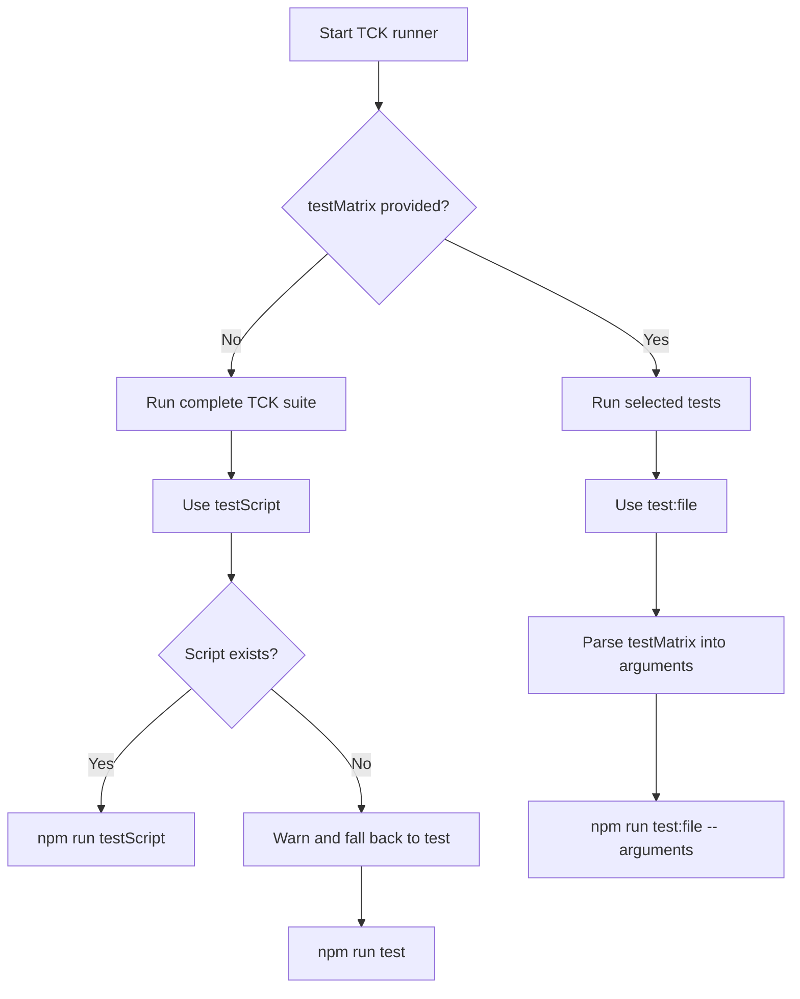

# Configure TCK Tests

The Hiero TCK Action runs the Hiero TCK against the configured JSON-RPC server.

**By default, the action runs the complete TCK test suite.** You only need to configure `testMatrix` when you want to run a specific subset of tests.

----

## Run the Complete TCK Suite

No test configuration is required to run the complete TCK suite:

```yaml
- name: Run Hiero TCK
  uses: hiero-hackers/hiero-tck-action@main
```

By default, the action uses the `test:ci` npm script:

```text
test:ci
```

The runner effectively executes:

```bash
npm run test:ci
```

This runs the **full TCK test suite** for the selected TCK version.

!!! note
    
    If `test:ci` is not available in the selected TCK version, the action logs a warning and falls back to the `test` script.


---

## Run a Custom Test Script

Use `testScript` to select a different npm script:

```yaml
- name: Run TCK
  uses: hiero-hackers/hiero-tck-action@main
  with:
    testScript: test
```

The default value is:

```text
test:ci
```

The runner effectively executes:

```bash
npm run <testScript>
```

If the requested script does not exist in `package.json`, the runner falls back to:

```bash
npm run test
```

A warning is emitted when this fallback occurs.

---

## Run Selected Tests with `testMatrix`

Use `testMatrix` when you want to run **only selected TCK tests** instead of the complete test suite.

For example:

```yaml
- name: Run token service tests
  uses: hiero-hackers/hiero-tck-action@main
  with:
    testMatrix: |
      src/tests/token-service/*.ts
```

When `testMatrix` is set, the runner uses the TCK `test:file` script instead of `testScript`.

The resulting command is equivalent to:

```bash
npm run test:file -- <arguments>
```

### Multiple Test Selections

Multiple lines can be supplied:

```yaml
- name: Run selected TCK tests
  uses: hiero-hackers/hiero-tck-action@main
  with:
    testMatrix: |
      src/tests/token-service/*.ts
      src/tests/crypto-service/test-account-create-transaction.ts
```

Each non-empty line is converted into an argument for the `test:file` script.

### Pass Additional Test Arguments

Arguments can also be included with a test selection:

```yaml
- name: Run filtered tests
  uses: hiero-hackers/hiero-tck-action@main
  with:
    testMatrix: |
      src/tests/crypto-service/*.ts --grep 'Creates an account'
```

The complete value is processed into command arguments and passed to `test:file`.

---

## When `testMatrix` Takes Precedence

When `testMatrix` is non-empty, the runner does not use `testScript`.

The execution flow is:



---

## Targeted Test Examples

### Token Service

```yaml
testMatrix: |
  src/tests/token-service/*.ts
```

### Specific Test File

```yaml
testMatrix: |
  src/tests/crypto-service/test-account-create-transaction.ts
```

### Filter Tests

```yaml
testMatrix: |
  src/tests/crypto-service/*.ts --grep 'Creates an account'
```

---

## Run Tests in a GitHub Actions Matrix

`testMatrix` can be combined with GitHub Actions' job matrix to distribute different test selections across jobs.

```yaml
jobs:
  tck:
    strategy:
      matrix:
        test:
          - src/tests/token-service/*.ts
          - src/tests/crypto-service/*.ts

    steps:
      - uses: actions/checkout@v7

      - name: Run TCK
        uses: hiero-hackers/hiero-tck-action@main
        with:
          testMatrix: ${{ matrix.test }}
```

Each job passes its matrix value to the TCK `test:file` script.


----

## Test Output

The runner writes the TCK process output to:

```text
tck-output.log
```

The command output is both displayed in the workflow log and written to this file.
