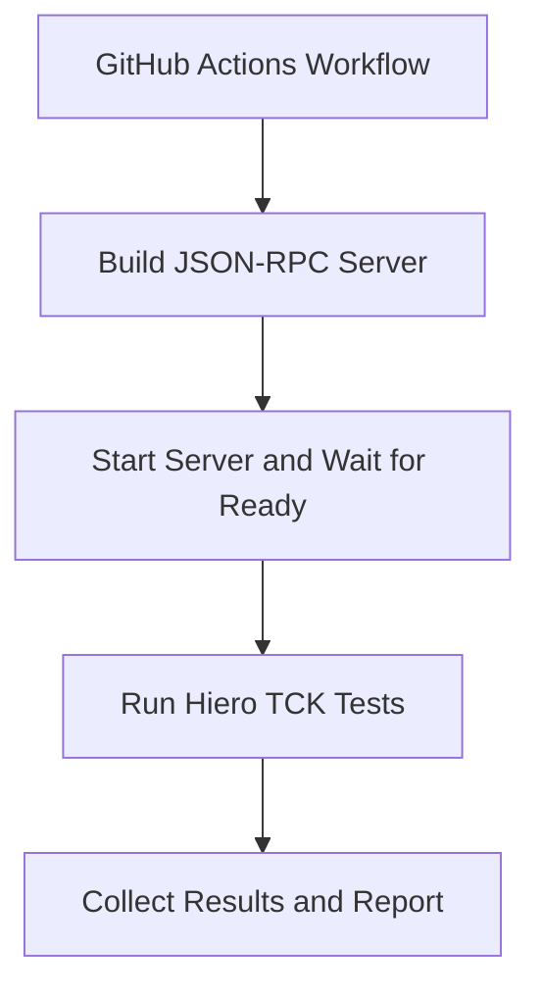

#  Hiero TCK Action

The **Hiero TCK Action** runs the [Hiero SDK Technology Compatibility Kit (TCK)](https://github.com/hiero-ledger/hiero-sdk-tck) against a Hiero SDK JSON-RPC server in GitHub Actions.

The action can:

- Build and start a JSON-RPC server from a bundled SDK preset or custom Dockerfile.
- Run the TCK against an already-running server.
- Run the complete TCK suite or selected tests.
- Split tests across GitHub Actions matrix jobs.
- Wait for the JSON-RPC server to become ready before running tests.
- Collect and classify TCK results.
- Upload Mochawesome reports as workflow artifacts.
- Expose test results through GitHub Actions outputs.

---

## Motivation

The Hiero TCK Action provides a  way to run the Hiero SDK TCK test-suite against an SDK's JSON-RPC server in GitHub Actions. It helps SDK maintainers and contributors validate compatibility without requiring everyone to manually set up and run the complete TCK environment.

### Why the Action Exists

Today, changes to the JSON-RPC implementation are primarily validated through unit tests and manual testing. When a pull request introduces a new JSON-RPC method or changes existing implementation logic, reviewers may need to check the implementation and, when necessary, run the TCK manually against the contributor's branch. This can require cloning the branch, setting up the required environment, starting the JSON-RPC server and network, and running the appropriate TCK tests locally.

The action automates this process by handling the setup, server readiness, TCK execution, result collection, and reporting within GitHub Actions.

### Who Benefits from It

The action is primarily intended for **SDK maintainers and contributors** who develop or review JSON-RPC method implementations. It allows them to automatically validate changes against the TCK in CI, giving contributors and reviewers a consistent compatibility check without requiring them to set up and run the complete TCK environment locally.

### Why CI Is Useful

Running the TCK in CI makes compatibility testing part of the normal development workflow. Tests can run automatically for pull requests or other workflows, allowing compatibility regressions to be detected early.

It also provides a consistent environment for running the TCK, reducing differences caused by local operating systems, dependencies, network configuration, or developer-specific setup.

### Local Hardware Limitations

Running the complete TCK environment locally can require significant system resources. For example, running a local [Hiero Solo](https://github.com/hiero-ledger/solo) network can require **12 GB or more of RAM**.

Not every maintainer or contributor has a machine capable of running the complete environment. By running the TCK through GitHub Actions, these resource requirements are moved to CI infrastructure, allowing developers to validate compatibility even when their local machines cannot run the full setup.

### Benefits to SDKs

Integrating the Hiero TCK Action into an SDK's CI workflow provides:

* **Automated compatibility testing** against the Hiero SDK TCK.
* **Earlier detection of regressions** in JSON-RPC implementations.
* **Consistent and reproducible test execution** across SDKs.
* **Reduced manual setup** for contributors and reviewers.
* **Accessible test results and reports** directly from GitHub Actions.
* **Scalable execution** through GitHub Actions matrix jobs.

---

## How It Works

A typical TCK workflow consists of four stages:

!!! note

    The action can also **skip the server build and startup stages** when an external workflow manages the JSON-RPC server.

---

## Next Steps

- [Getting Started](getting-started.md) — Run the TCK with the default configuration.
- [Configure the Server](configure-server.md) — Configure SDK presets, custom Dockerfiles, and server startup.
- [Configure TCK Tests](configure-tests.md) — Select tests, configure test scripts, or shard the TCK suite.
- [Configure the Network](configure-network.md) — Configure the consensus node, operator account, and Mirror Node.
- [Reports and Outputs](reports.md) — Configure reports and consume TCK results.
- [Inputs Reference](reference.md) — View all available action inputs.