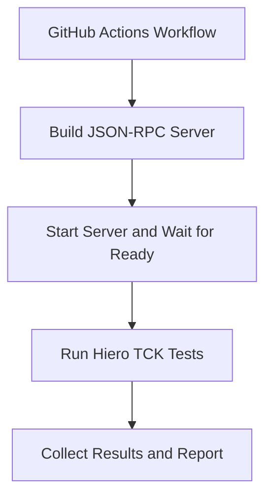

#  Hiero TCK Action

The **Hiero TCK Action** runs the [Hiero SDK Technology Compatibility Kit (TCK)](https://github.com/hiero-ledger/hiero-sdk-tck) against a Hiero SDK JSON-RPC server in GitHub Actions.

The action can:

- Build and start a JSON-RPC server from a bundled SDK preset or custom Dockerfile.
- Run the TCK against an already-running server.
- Run the complete TCK suite or selected tests.
- Split tests across GitHub Actions matrix jobs.
- Wait for the JSON-RPC server to become ready before running tests.
- Collect and classify TCK results.
- Upload Mochawesome reports as workflow artifacts.
- Expose test results through GitHub Actions outputs.

---

## How It Works

A typical TCK workflow consists of four stages:

!!! note

    The action can also **skip the server build and startup stages** when an external workflow manages the JSON-RPC server.

---

## Next Steps

- [Getting Started](getting-started.md) — Run the TCK with the default configuration.
- [Configure the Server](configure-server.md) — Configure SDK presets, custom Dockerfiles, and server startup.
- [Configure TCK Tests](configure-tests.md) — Select tests, configure test scripts, or shard the TCK suite.
- [Configure the Network](configure-network.md) — Configure the consensus node, operator account, and Mirror Node.
- [Reports and Outputs](reports.md) — Configure reports and consume TCK results.
- [Inputs Reference](reference.md) — View all available action inputs.