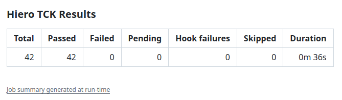

# Reports and Outputs 

The **Hiero TCK Action** collects and summarizes the results produced by the Hiero SDK TCK.

The action always attempts to collect the results after the TCK run, even when the test suite exits with a non-zero status.


---

## Mochawesome Report

The TCK generates a Mochawesome JSON report at:

```text
hiero-tck/mochawesome-report/mochawesome.json
```

The action reads this report to collect the test statistics and classify failures.

If the report is not produced, the action reports:

> No report was produced - the suite did not run to completion.

In this case, the report-related outputs are set to zero or empty values, and the workflow can continue to the remaining cleanup steps.

---

## GitHub Actions Summary

The action writes a test summary to the GitHub Actions job summary.

The summary includes:

| Result        | Description                               |
| ------------- | ----------------------------------------- |
| Total         | Total number of tests reported by the TCK |
| Passed        | Tests that passed                         |
| Failed        | Tests reported as failed by the TCK       |
| Pending       | Tests reported as pending                 |
| Hook failures | Suite-level hook failures                 |
| Skipped       | Registered tests that did not run         |
| Duration      | Total reported test duration              |

Example:

{ loading=lazy }

---

## Parallel Test Runs

The default `test:ci` script runs the TCK suite in parallel.

In some cases, Mocha's parallel execution does not provide per-test failure details in the Mochawesome report. When this happens, the action cannot classify or list the individual failing tests.

The summary reports that the failures could not be classified and recommends running the suite serially:

```yaml
with:
  testScript: test:serial
```

A serial run provides the individual test information needed to identify which tests failed.

---

## Action Outputs

The action exposes the collected results as outputs so that workflows can consume them in later steps.

| Output                 | Description                                            |
| ---------------------- | ------------------------------------------------------ |
| `total`                | Total number of TCK tests executed                     |
| `passed`               | Number of passing tests                                |
| `failed`               | Number of failing tests                                |
| `pending`              | Number of pending tests                                |
| `hookFailures`         | Number of failed suite hooks                           |
| `skipped`              | Number of registered tests that never ran              |
| `registered`           | Number of tests registered by the suite                |
| `genuineFailures`      | Failures classified as actual test failures            |
| `infraFailures`        | Failures caused by server or network errors            |
| `unimplementedMethods` | Comma-separated list of unimplemented JSON-RPC methods |
| `reportPath`           | Path to the generated Mochawesome report directory     |

Example:

```yaml
- name: Show TCK results
  run: |
    echo "Total: ${{ steps.tck.outputs.total }}"
    echo "Passed: ${{ steps.tck.outputs.passed }}"
    echo "Failed: ${{ steps.tck.outputs.failed }}"
    echo "Infrastructure failures: ${{ steps.tck.outputs.infraFailures }}"
```

---

## Report Artifact

The Mochawesome report can be uploaded as a GitHub Actions artifact.

Artifact upload is enabled by default:

```yaml
with:
  uploadReport: true
```

The default artifact name is:

```text
tck-report
```

It can be changed with `artifactName`, which is particularly useful when the TCK is split across multiple matrix jobs.

For example:

```yaml
strategy:
  matrix:
    test:
      - crypto
      - token
      - schedule

steps:
  - uses: hiero-hackers/hiero-tck-action@main
    with:
      testMatrix: "src/tests/${{ matrix.test }}/**/*.ts"
      artifactName: "tck-report-${{ matrix.test }}"
```

The artifact contains the generated Mochawesome report directory.

Artifacts are retained for **14 days** by default.

To disable report upload:

```yaml
with:
  uploadReport: false
```

---


## No Report Produced

If the TCK does not produce the expected Mochawesome report, the action does not attempt to classify individual failures.

The outputs are set as follows:

```text
total=0
passed=0
failed=0
pending=0
hookFailures=0
skipped=0
registered=0
genuineFailures=0
infraFailures=0
unimplementedMethods=
reportPath=
```

The GitHub Actions summary indicates that the suite did not run to completion.

!!! note
    
    This can occur when the TCK fails before producing its report, for example because of an early setup, server, or test-runner failure.
